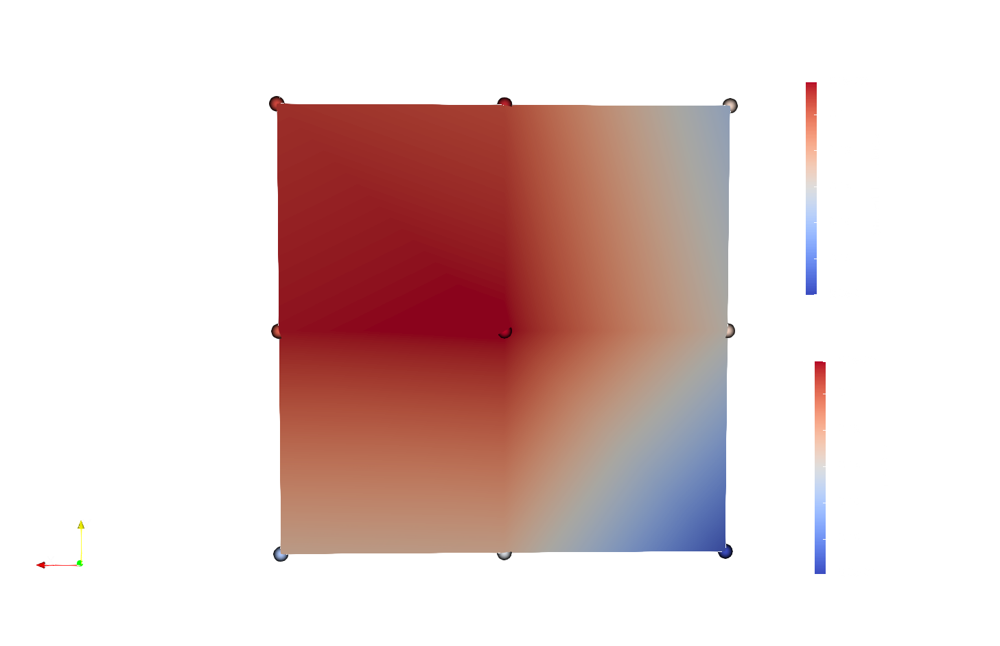

# Coupling a muscle with a quasistatic tendon

The goal of this case is to debug the use of a tendon quasistatic solver for coupling purposes. The goal is to get matching traction values at the interface, eg. get implicit coupling to converge. 

> **Warning**
> The `run()` method in the `HyperelasticitySolver` outputs after calling the non-linear solver. In order not to get the output for the tendon quasistatic duplicated you can comment the output after the solver call in `02_hyperelasticity_solver.tpp`. However I didn't push this because otherwhise we loose the output in `cubic_tendon/`.
```
  // if (withOutputWritersEnabled)
  // {
  //   this->outputWriterManager_.writeOutput(this->data_, 0, 0.0, 0);
  //   this->outputWriterManagerPressure_.writeOutput(this->pressureDataCopy_, 0, 0.0, 0);
  // }

  this->nonlinearSolve();
  postprocessSolution();

  // stop duration measurement
  if (this->durationLogKey_ != "")
    Control::PerformanceMeasurement::stop(this->durationLogKey_);

  // write current output values
  // if (withOutputWritersEnabled)
  // {
  //   this->outputWriterManager_.writeOutput(this->data_, 1, endTime_);
  //   this->outputWriterManagerPressure_.writeOutput(this->pressureDataCopy_, 1, endTime_);
  // }
```

## How to build and run

To build the muscle and quasistatic tendon solvers:
```
cd muscle_quasistatictendon/
mkorn && sr
cd build_release
```

You will need two terminals to run the example. In the first terminal execute
```
cd muscle_tendon/build_release
./muscle_neuromuscular.cpp ../settings_muscle.py
```

and in the second one run
```
cd muscle_tendon/build_release
./tendon_quasistatic.cpp ../settings_tendon.py
```

Alternatively you can choose a linear quasistatic solver for the tendon
```
cd muscle_tendon/build_release
./tendon_quasistatic.cpp ../settings_tendon.py
```

## Discussion of results (EXPLICIT)

Assume `n_elements_muscle1 = [2, 2, 20]` and `n_elements_tendon = [2, 2, 4]`

- linear_quasistatic with `dt=0.01`:
Not looking good. The corners (xmax, 0) and (0, ymax) are off. But maybe a absolute convergence of 1e-2 could still be satisfied. 

- quasistatic with `dt=0.01`:
**Works properly** :tada:
Even the corner values match! The image below corresponds to t=10ms, when the muscle is contracted. The image shows the values provided by precice, that is, our boundary condition and the actual traction field in the tendon.


## Discussion of results (IMPLICIT)

- first attempt: 
We apply an absolute convergence criterium.

```
<max-iterations value="10" />
<absolute-convergence-measure limit="1e-6" data="Displacement" mesh="TendonMeshLeft" strict="1"/>
<absolute-convergence-measure limit="1e-2" data="Traction" mesh="MuscleMeshLeft" strict="1"/>
```



> **Warning**
> Doesn't look as good as the explicit one. Hopefully a stricter convergence criterium will solve it.

- second attempt:
The motivation is to have an stricter criteria for convergence.

```
<max-iterations value="50" />
<relative-convergence-measure limit="1e-4" data="Displacement" mesh="TendonMeshLeft" strict="1"/>
<relative-convergence-measure limit="1e-2" data="Traction" mesh="MuscleMeshLeft" strict="1"/>
```

Acceleration is necessary in this case. In particular I use

```
<acceleration:aitken>
    <data name="Traction" mesh="MuscleMeshLeft"/>
    <initial-relaxation value="0.1"/>
</acceleration:aitken> 
```
I observed that using 
```
<acceleration:constant>
    <relaxation value="0.5"/>
</acceleration:constant>
```
leads to a worse performance that not using acceleration at all. 

TODO: **try larger timestep `dt=0.1`**